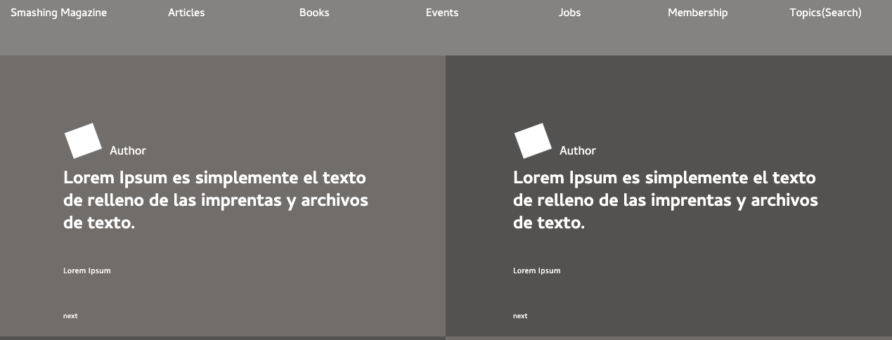

# Design-Teardown 
> Project consist of a heat map for the Smash Magazine Website homepage

You can find the original project specification at: https://www.theodinproject.com/courses/html5-and-css3/lessons/design-teardown

## Built With

- CSS and HTML
- Float
- Box Model
- FlexBox
- CSS Grid

## Live Demo

[Live Demo Link](https://rawcdn.githack.com/nriqu322/Desgin-teardown/14b0d80f0cdd3d857ed38390615c4630bf00fe46/index.html)

## Getting Started

**This is a static page and was made using  CSS & HTML, you don't need .**
**anything to start up this page, is already published in a public repository so you can check the final result. For a better understanding of the code read about FlexBox,Grid and Floats.**

## Authors

👤 **Luis Saavedra**

- Github: [@LuisSaavedra](https://github.com/nriqu322)
- Twitter: [@LuisSaavedra](https://twitter.com/nriqu322)
- Linkedin: [Luis Saavedra](https://linkedin.com/in/luis-saavedra-sanchez/)

👤 **Elbie Moonga**

- GitHub: [@Elbie-Em](https://github.com/Elbie-em)
- Twitter: [ElbieEm](https://twitter.com/ElbieEm)
- LinkedIn: [elbie-moonga](https://www.linkedin.com/in/elbie-moonga-253bbb12b/)

## 🤝 Contributing

Contributions, issues and feature requests are welcome!

Feel free to check this link --> [here](https://github.com/nriqu322/Desgin-teardown/issues) for issues.

## Show your support

Give a ⭐️ if you like this project!

## 📝 License

This project is [MIT](lic.url) licensed.
